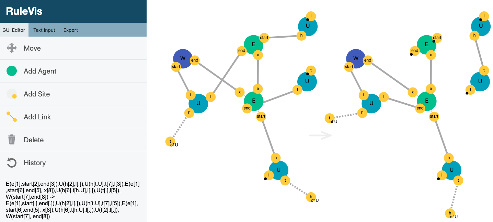

# RuleVis: Constructing Patterns and Rules for Rule-based Models

We introduce *RuleVis*, a web-based application for defining and editing "correct-by-construction" executable rules that model biochemical functionality, and which can be used to simulate the behavior of protein-protein interaction networks and other complex systems. Our application bridges the graph rewriting and systems biology research communities by providing an external visual representation of salient patterns that experts can use to determine the appropriate level of detail in a particular modeling context. 

This project is a collaboration between the UCSC Creative Coding Lab and the Walter Fontana Group at Harvard Medical School. Our short paper has been accepted to IEEE VIS 2019, and a version of our paper can be found [here](https://github.com/CreativeCodingLab/RuleVis/blob/master/2019_IEEEVIS_ShortPapers_RuleVis.pdf). The tool uses the same syntax from the [Kappa Language](https://kappalanguage.org/), a rule-based language for modeling interacting networks. The application is available online [here](https://creativecodinglab.github.io/RuleVis/).

Above we see a screenshot of the *RuleVis* interface, depicting a user in the process of building a rule, consisting of two patterns representing the 'before' and 'after' states of the system (separated by an arrow). The editor panel (left) enables users to manually add, name, and delete agents, sites, and links to the visualization in the display panel (right). A user can also directly modify the text representation of the rule (the text string and visualization are mirrored, such that changes made to one are immediately reflected in the other).

*RuleVis* is a lightweight web application written in Javascript that runs in any browser. [D3.js](https://d3js.org/) handles interaction with the dynamic SVG canvas while the [Cola.js library](https://ialab.it.monash.edu/webcola/) is used to for the constraint-based layout of our visualization. We used [Yurii Lahodiuk's implementation](https://github.com/lagodiuk/earley-parser-js) of an Earley parser in Javascript to implement the  context-free grammar (CFG) specified by Kappa documentation. 

## Authors & Contact Information

David Abramov, Jasmine Otto, Mahika Dubey, Cassia Artanegara, Angus Forbes   
Department of Computational Media, University of California Santa Cruz   
{dabramov, jtotto, mahika, cartaneg, angus}@ucsc.edu   

Pierre Boutillier, Walter Fontana    
Department of Systems Biology, Harvard Medical School     
{pierre_boutillier, walter_fontana}@hms.harvard.edu    
